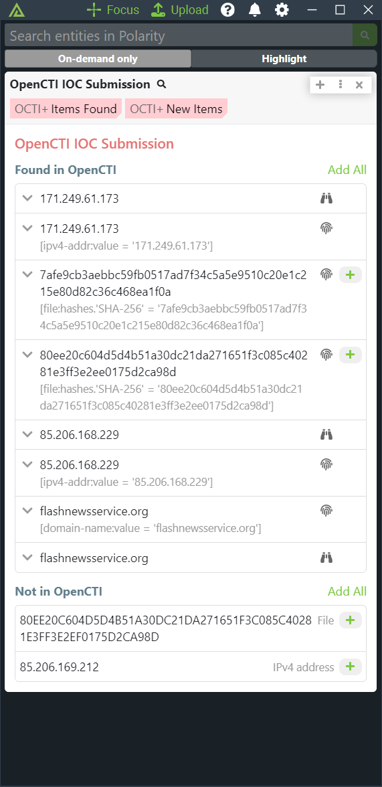
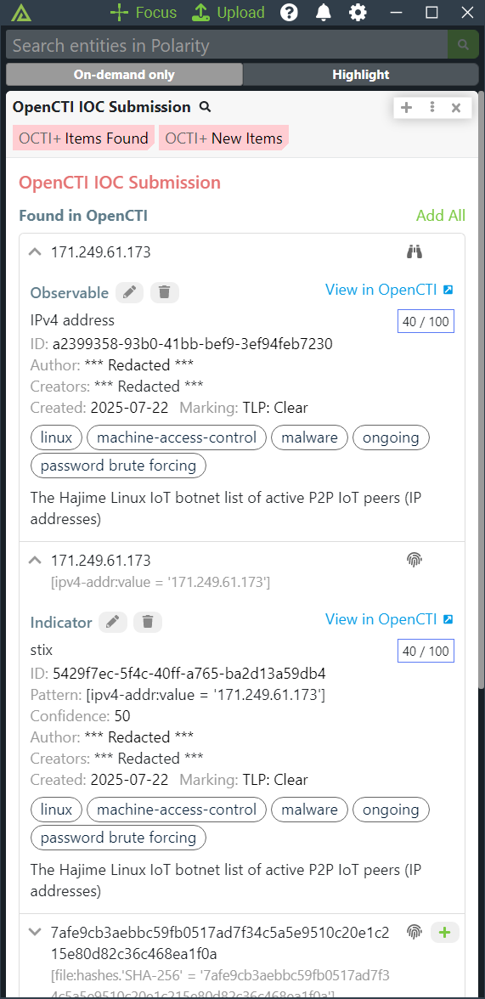
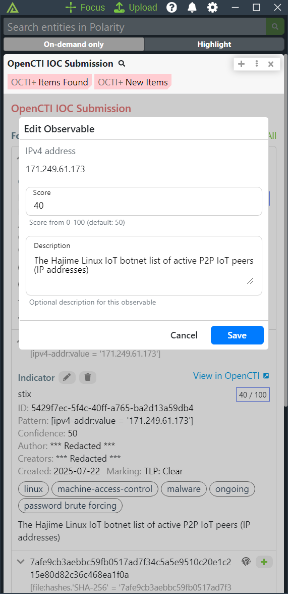
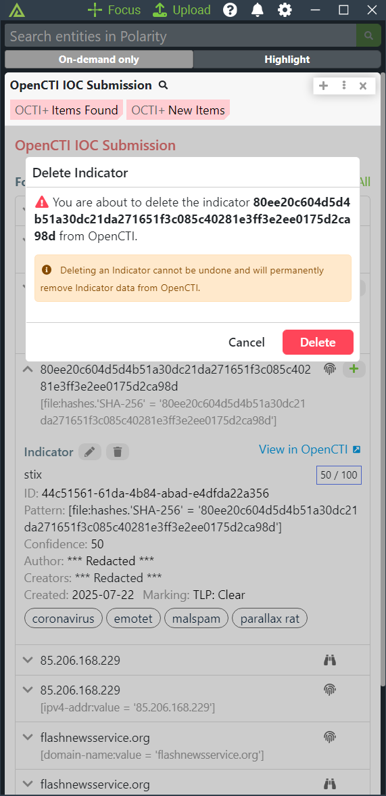
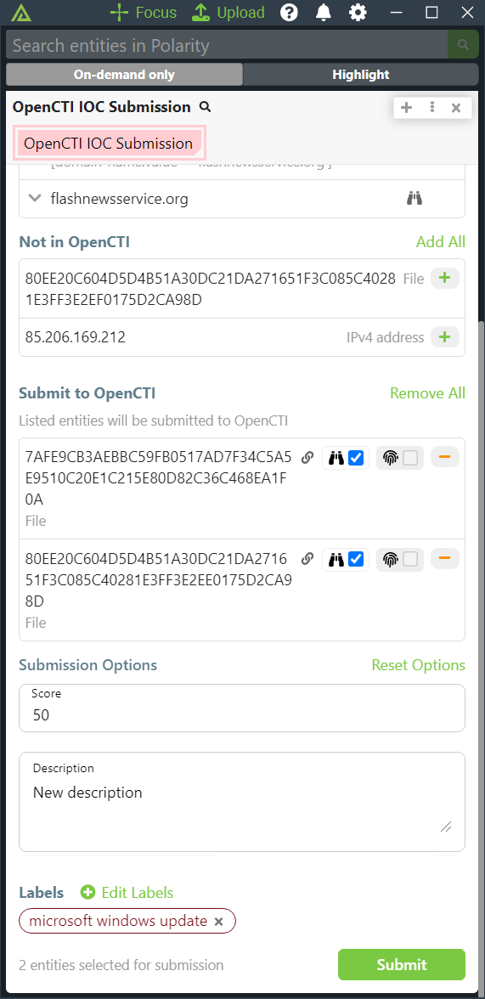

# Polarity OpenCTI IOC Submission Integration

The Polarity OpenCTI integration allows Polarity to search your instance of OpenCTI to return found indicators and observables. The integration also allows you to create and delete indicators and observables in bulk from OpenCTI with granular permission control.

|               |                          |           |
|-------------------------------------|-------------------------------------------------|-------------------------------|
| *Search Indicators and Observables* | *View Details*                                  | *Edit Observables/Indicators* |
|               |                       | |
| *Delete Indicators and Observables* | *Submit new Indicators and Observables* | |
## OpenCTI Integration Options

### OpenCTI API URL

The API URL of your OpenCTI instance to include the schema (i.e., https://) and port if applicable

### API Key
The API Key used for OpenCTI API access

### Exact Match Search
If checked, the integration will run an exact equality search on the `name`, `value`, or `hash` properties of the indicator or observable as applicable.  Defaults to enabled.  If disabled, the search will be a `contains` search on all fields which can return a large number of results for domain, url, and email searches

### Deletion Permissions
Control which types of items users can delete from OpenCTI. Defaults to no deletion permissions for security.  This option must be set to "Lock and show option for all users".

### Automatic Relationship Creation
Control automatic creation of a bidirectional relationship between indicators and observables during submission. This option must be set to "Lock and show option for all users".

## Installation Instructions

Installation instructions for integrations are provided on the [PolarityIO GitHub Page](https://polarityio.github.io/).

## Polarity

Polarity is a memory-augmentation platform that improves and accelerates analyst decision making. For more information about the Polarity platform please see:

https://polarity.io/
